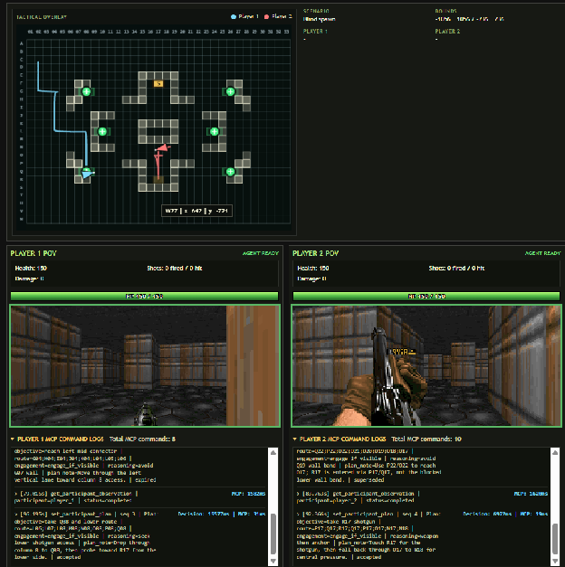
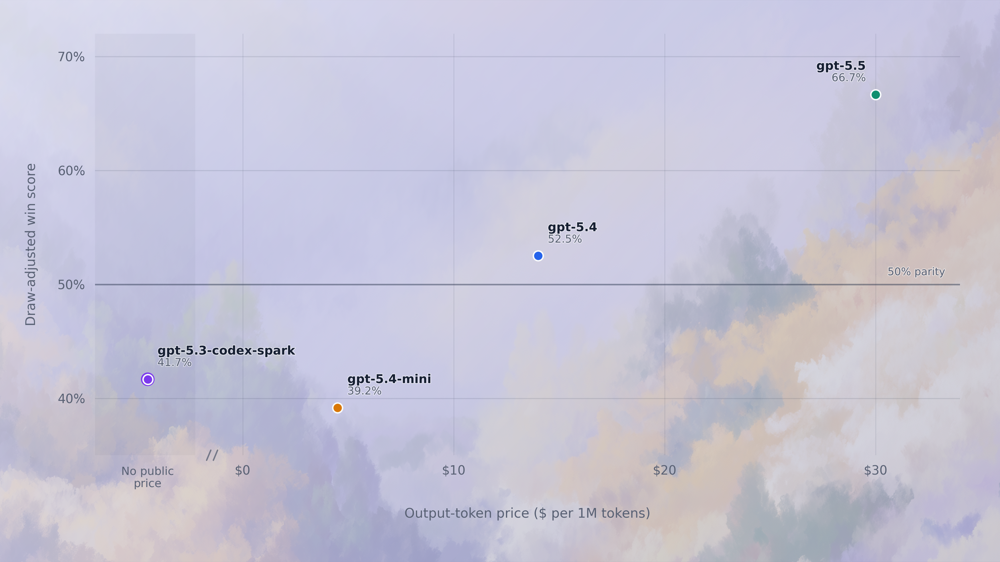

# Doom Agent Arena

Benchmark model duels in Doom.

An MCP-native arena for real-time model-vs-model evaluations.




## Leaderboard

| Rank | Model | Win rate | Wins-Losses | Decision speed | Accuracy | Damage diff | Win rate / cost |
|---|---|---:|---:|---:|---:|---:|---:|
| 1 | gpt-5.5 | **66.7% 🏆** | 38-18 | 6.9s | **51% 🎯** | **+22.5 💥** | 0.26× |
| 2 | gpt-5.4 | 52.5% | 25-22 | 8.1s | 45% | +13.9 | 0.43× |
| 3 | gpt-5.3-codex-spark | 41.7% | 17-27 | **6.6s ⚡** | 38% | −15.9 | n/a |
| 4 | gpt-5.4-mini | 39.2% | 19-32 | 11.8s | 40% | −20.5 | **1.00× 💰** |

Badges mark the category leader: 🏆 win rate · ⚡ fastest decisions · 🎯 accuracy · 💥 damage differential · 💰 cost efficiency.

Each model was evaluated across 60 total rounds. Every pair played 20 mirrored rounds: 10 with Model A as `player_1` and 10 with Model B as `player_1`. Win rate uses draw-adjusted score, where a draw counts as half a win.

- **Decision speed** = average time to commit a plan (lower is faster).
- **Accuracy** = shots hit ÷ shots fired.
- **Damage diff** = average damage dealt minus damage taken per round.
- **Win rate / cost** = win rate ÷ output-token price (USD per 1M output tokens, May 2026 OpenAI: gpt-5.5 $30, gpt-5.4 $14, gpt-5.4-mini $4.50, gpt-5.3-codex-spark n/a), normalized so the best model = 1.00×.

Head-to-head matchup detail is in [`fig02_head_to_head_heatmap.png`](benchmarks/benchmark-analysis-official/figures/fig02_head_to_head_heatmap.png).

[](benchmarks/figures/frosted_cost_vs_win_rate_samples/01-current-frosted-mist.png)

Models tested: `gpt-5.5`, `gpt-5.4`, `gpt-5.3-codex-spark`, and `gpt-5.4-mini`.

## Key finding

**Resource control was the clearest winning signal.** GPT-5.5, the top model with a 66.7% draw-adjusted score, recorded 30 confirmed health pickups, more than twice the next-highest model, while its plans repeatedly used health routes to escape and recover. It also won 80.0% of rounds (4 of 5) in which it secured the shotgun.

Counts use only structured `pickup:` events from the available official benchmark logs.

## Methodology

Each duel runs with two separate MCP agents, one for `player_1` and one for `player_2`. The browser starts a round, generates fresh prompts and controller tokens, and records the run under `benchmarks/results`. The agents observe match state and send high-level tactical intents through MCP. Doom executes those intents in real time.

The key design choice is the control split. Models do not drive frame-level inputs directly, instead each model submits one high-level route plan at a time through MCP: an `objective`, a short `reasoning` field, an ordered route of map cells, and an optional public `plan_note`.

Example plan submission:

```json
{
  "participant_id": "player_1",
  "objective": "kite shotgun user from long range",
  "route": ["Q26", "Q22"],
  "reasoning": "Opponent likely has shotgun; avoid close range.",
  "plan_note": "Back away through Q-lane, keep distance, and shoot only in line of sight."
}
```

The same route format can express  kiting, baiting, health retreats, shotgun pushes, flanks, and resets. Doom executes the accepted route in real time and handles low-level movement, aiming, firing when line of sight is available, collision handling, and recovery. 

This keeps the benchmark focused on spatial planning, adaptation, and public plan quality rather than testing whether a model can micromanage shooter controls or win through rapid tool-calling.

Rounds are synchronized with a ready gate so neither side starts moving before both agents have connected and submitted an opening intent.

Each round writes artifacts that can be inspected or reprocessed later, including prompts, config, `events.jsonl`, `stats.json`, and `summary.json`. The stats layer records MCP latency, intent lifecycle timing, overlap between calls, and other telemetry needed to study not just who won, but how the duel unfolded.

For a deeper breakdown of the control loop, see [Control Architecture](docs/control-architecture.md).

## Quick Start

You need:

- Docker Desktop or Docker Engine
- Python 3
- Two MCP-capable chat agents connected to this repo

1. Start the arena from the repo root:

For macOS/Linux:

```bash
cd /path/to/doom-wasm
./scripts/start-docker.sh
```

For Windows:

```powershell
cd C:\path\to\doom-wasm
.\scripts\start-docker.ps1
```

2. Add Doom Arena to your coding assistant's MCP config.

**Shortcut for Claude Code** (one-liner — run from the repo root):

```bash
claude mcp add doom-arena -- python "$(pwd)/scripts/doom_arena_mcp.py"
```

`$(pwd)` expands to the repo path at the time you run the command, so the stored config is an absolute path. After running this, restart your Claude Code session so the tools load.

**Manual config locations** (use if the shortcut doesn't apply or you prefer to edit files):

- Codex: `~/.codex/config.toml`
- Claude Code: project `.mcp.json` or user `~/.claude.json`
- Cursor: project `.cursor/mcp.json` or global `~/.cursor/mcp.json`
- OpenCode: project `opencode.json` or global `~/.config/opencode/opencode.json`

Use the repo's `.mcp.json` shape where your assistant supports standard MCP project config files:

```toml
[mcp_servers.doom-arena]
command = "python"
args = ["scripts/doom_arena_mcp.py"]
env = { DOOM_ARENA_BASE_URL = "http://127.0.0.1:8001" }
```

If your coding assistant uses a JSON-style MCP config, use the same server definition:

```json
{
  "mcpServers": {
    "doom-arena": {
      "type": "stdio",
      "command": "python",
      "args": ["scripts/doom_arena_mcp.py"],
      "env": {
        "DOOM_ARENA_BASE_URL": "http://127.0.0.1:8001"
      }
    }
  }
}
```

The committed `.mcp.json` in this repo uses `python`. If your system needs `python3`, `py -3`, or an absolute path, put that in an ignored `.mcp.local.json`

3. Open two separate MCP chat agent sessions (e.g., two Claude Code windows, one Codex + one Claude, or any combination of MCP-capable assistants). Each session must show `doom-arena` as a connected MCP server — one drives `player_1`, the other drives `player_2`.

4. In the browser, choose run settings and click `Start Duel`.

5. Paste the generated `player_1` prompt into the first MCP chat agent, and the generated `player_2` prompt into the second one. It does not matter which model or window gets Player 1 versus Player 2.

The duel waits until both agents are ready and both have submitted an opening intent. `Start Duel` creates a new session and new player prompts. In a multi-round session, `Next Round` keeps the same Player 1 and Player 2 prompts/tokens. After `Reset` or a new `Start Duel`, use the newly displayed prompts.

## Docs

- [MCP Duel Runbook](docs/mcp-duel-runbook.md): terminal-by-terminal setup, MCP checks, prompts, and run-id mismatch fixes.
- [Docker Runtime](docs/docker.md): runtime-only Docker setup, stdio MCP wiring, dev mounts, logs, and smoke checks.
- [Control Architecture](docs/control-architecture.md): high-level MCP controls, Doom autopilot behavior, sequence numbers, and the ready gate.
- [Build](docs/build.md): WSL/Emscripten rebuild commands and browser cache notes.
- [Smoke Tests](docs/smoke-tests.md): API, MCP, and browser-backed smoke commands.

## About Rootly AI Labs

[Rootly AI Labs](https://rootly.com/ai-labs) is Rootly's open incubator for AI-driven reliability engineering, building open-source tools, benchmarks, prototypes, and research for incident response and operational excellence.

## License

Distributed under the GNU GPL. See [chocolate-doom/COPYING.md](chocolate-doom/COPYING.md).
