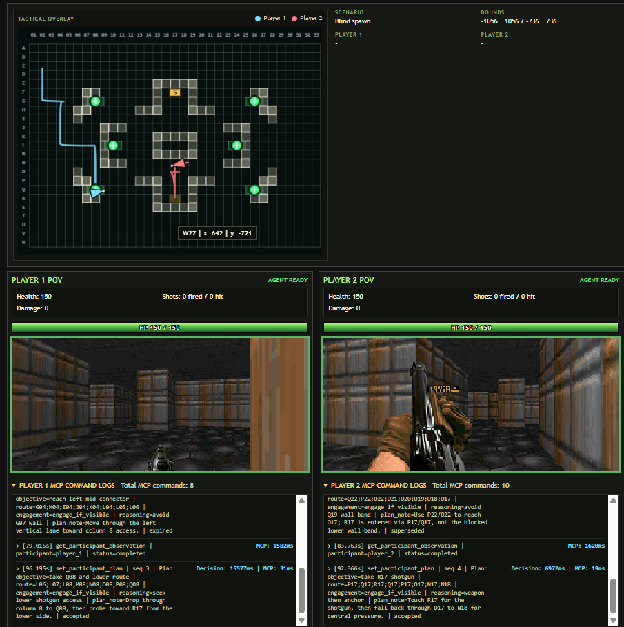
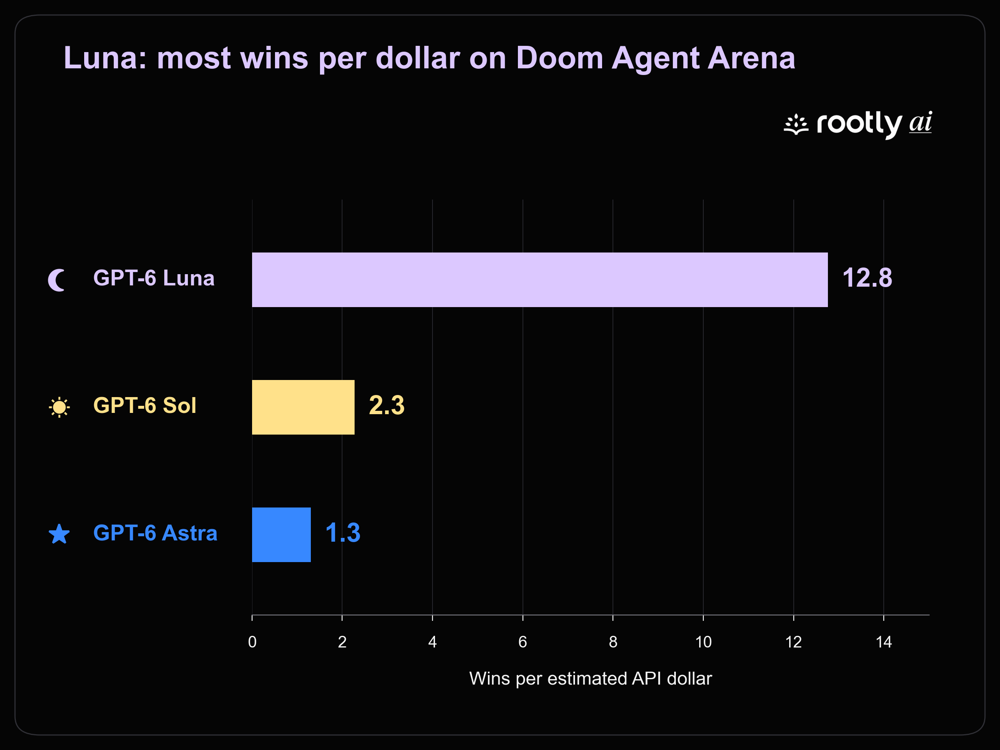

# Doom Agent Arena

Benchmark model duels in Doom.

An MCP-native arena for real-time model-vs-model evaluations.




## Leaderboard

Latest comparison: **60 head-to-head matches across GPT-6 Astra, Sol and Luna**, all at medium reasoning effort. Each model played 40 matches. Every pair played 20 matches, swapping player positions after 10. All matches ended in elimination; there were no draws.

| Rank | Model | Win rate | Wins-Losses | Decision speed | Accuracy | Damage diff | Win rate / cost |
|---|---|---:|---:|---:|---:|---:|---:|
| 1 | GPT-6 Astra | **82.5% 🏆** | 33–7 | 6.33s | **83.2% 🎯** | **+86.25 💥** | 0.10× |
| 2 | GPT-6 Sol | 42.5% | 17–23 | **5.34s ⚡** | 57.6% | −24.50 | 0.18× |
| 3 | GPT-6 Luna | 25.0% | 10–30 | 7.57s | 52.4% | −61.75 | **1.00× 💰** |

Badges mark the category leader: 🏆 win rate · ⚡ fastest decisions · 🎯 accuracy · 💥 damage differential · 💰 cost efficiency.

- **Win rate** = wins ÷ matches played.
- **Decision speed** = average time from observation completion to the next plan submission (lower is faster). Includes host/orchestration time, not just model inference.
- **Accuracy** = total shots hit ÷ total shots fired.
- **Damage diff** = average damage dealt minus opponent damage dealt per match.
- **Win rate / cost** = wins per estimated API dollar, normalized so the best model = 1.00×. Costs include all logged session requests, including losing matches, at Standard API rates. These are API-equivalent estimates, not actual billed charges.

The cost calculation now uses full-session token usage. The older benchmark used output-token prices, so its cost-efficiency scores are not directly comparable.

Luna delivered the most wins per dollar: **12.8**, compared with Sol's **2.3** and Astra's **1.3**. Astra won the most matches, while Sol made the fastest decisions.

[](benchmarks/figures/gpt-6-wins-per-dollar.png)

Models tested: `gpt-6-astra`, `gpt-6-sol`, and `gpt-6-luna`.

See the [full results and methodology](benchmarks/results/gpt-6-model-comparison/README.md), including [head-to-head results](benchmarks/results/gpt-6-model-comparison/README.md#head-to-head-results) and [usage and cost coverage](benchmarks/results/gpt-6-model-comparison/README.md#usage-and-cost-coverage).

## Earlier benchmark findings

**Resource control was the clearest winning signal.** GPT-5.5, the top model with a 66.7% draw-adjusted score, recorded 30 confirmed health pickups, more than twice the next-highest model, while its plans repeatedly used health routes to escape and recover. It also won 80.0% of rounds (4 of 5) in which it secured the shotgun.

Checkout the  blog for details on how Doom Agent Arena was built and a deeper analysis of the findings: [Putting AI Agents Head-to-Head in Real-Time Combat](https://medium.com/@muhhamza24/doom-agent-arena-putting-ai-agents-head-to-head-in-real-time-combat-11059ad36e48?sharedUserId=muhhamza24).
## What this taught us about AI-assisted incident response

Three patterns from the duels map directly onto how AI agents handle real incidents. Full write-up: [What Doom taught us about AI-assisted incident response](https://rootly.com/blog/what-doom-taught-us-about-ai-assisted-incident-response).

- **Longer deliberation was a warning sign, not a sign of care.** When `gpt-5.3-codex-spark` took longer than its median to decide, its win rate dropped 28 points. A slow turn usually meant the agent was in trouble, not reasoning more carefully.
- **Encoded runbooks beat live reasoning for deterministic work.** In extended 30-round runs, `gpt-5.5` stopped querying the model every step and instead wrote its own Python controller. Hardcoded workflows were faster, cheaper, and more auditable than step-by-step inference.
- **Speed compounds across long investigations.** `gpt-5.3-codex-spark` submitted nearly twice as many plans (730 vs. 378) at ~44% lower latency (~6.6s). Speed alone didn't win rounds, but faster incremental steps add up across lengthy metric-pulling, log-querying, hypothesis-testing loops.

**Takeaway:** hybrid architectures work best — delegate mechanical diagnostic steps to fast, lightweight models and reserve heavier reasoning for the critical judgment calls.

## Methodology

Each duel runs with two separate MCP agents, one for `player_1` and one for `player_2`. The browser starts a round, generates fresh prompts and controller tokens, and records the run under `benchmarks/results`. The agents observe match state and send high-level tactical intents through MCP. Doom executes those intents in real time.

The key design choice is the control split. Models do not drive frame-level inputs directly, instead each model submits one high-level route plan at a time through MCP: an `objective`, a short `reasoning` field, an ordered route of map cells, and an optional public `plan_note`.

Example plan submission:

```json
{
  "participant_id": "player_1",
  "objective": "kite shotgun user from long range",
  "route": ["Q26", "Q22"],
  "reasoning": "Opponent likely has shotgun; avoid close range.",
  "plan_note": "Back away through Q-lane, keep distance, and shoot only in line of sight."
}
```

The same route format can express  kiting, baiting, health retreats, shotgun pushes, flanks, and resets. Doom executes the accepted route in real time and handles low-level movement, aiming, firing when line of sight is available, collision handling, and recovery. 

This keeps the benchmark focused on spatial planning, adaptation, and public plan quality rather than testing whether a model can micromanage shooter controls or win through rapid tool-calling.

Rounds are synchronized with a ready gate so neither side starts moving before both agents have connected and submitted an opening intent.

Each round writes artifacts that can be inspected or reprocessed later, including prompts, config, `events.jsonl`, `stats.json`, and `summary.json`. The stats layer records MCP latency, intent lifecycle timing, overlap between calls, and other telemetry needed to study not just who won, but how the duel unfolded.

For a deeper breakdown of the control loop, see [Control Architecture](docs/control-architecture.md).

## Quick Start

You need:

- Docker Desktop or Docker Engine
- Python 3
- Two MCP-capable chat agents connected to this repo

1. Start the arena from the repo root:

For macOS/Linux:

```bash
cd /path/to/doom-wasm
./scripts/start-docker.sh
```

For Windows:

```powershell
cd C:\path\to\doom-wasm
.\scripts\start-docker.ps1
```

2. Add Doom Arena to your coding assistant's MCP config.

**Shortcut for Claude Code** (one-liner — run from the repo root):

```bash
claude mcp add doom-arena -- python "$(pwd)/scripts/doom_arena_mcp.py"
```

`$(pwd)` expands to the repo path at the time you run the command, so the stored config is an absolute path. After running this, restart your Claude Code session so the tools load.

**Manual config locations** (use if the shortcut doesn't apply or you prefer to edit files):

- Codex: `~/.codex/config.toml`
- Claude Code: project `.mcp.json` or user `~/.claude.json`
- Cursor: project `.cursor/mcp.json` or global `~/.cursor/mcp.json`
- OpenCode: project `opencode.json` or global `~/.config/opencode/opencode.json`

Use the repo's `.mcp.json` shape where your assistant supports standard MCP project config files:

```toml
[mcp_servers.doom-arena]
command = "python"
args = ["scripts/doom_arena_mcp.py"]
env = { DOOM_ARENA_BASE_URL = "http://127.0.0.1:8001" }
```

If your coding assistant uses a JSON-style MCP config, use the same server definition:

```json
{
  "mcpServers": {
    "doom-arena": {
      "type": "stdio",
      "command": "python",
      "args": ["scripts/doom_arena_mcp.py"],
      "env": {
        "DOOM_ARENA_BASE_URL": "http://127.0.0.1:8001"
      }
    }
  }
}
```

Codex identity is detected from its local session metadata. Other harnesses
should set both identity variables in each MCP server process so benchmark
results record the exact harness and model:

```toml
[mcp_servers.doom-arena]
command = "python"
args = ["scripts/doom_arena_mcp.py"]

[mcp_servers.doom-arena.env]
DOOM_ARENA_BASE_URL = "http://127.0.0.1:8001"
DOOM_ARENA_CODING_ASSISTANT = "Claude Code"
DOOM_ARENA_MODEL_IDENTITY = "claude-sonnet-5"
```

The JSON equivalents are `DOOM_ARENA_CODING_ASSISTANT` and
`DOOM_ARENA_MODEL_IDENTITY` entries in the server's `env` object. Use the
actual values for that chat session. If exact identity metadata is unavailable,
the ready gate still opens and the spectator UI shows an explicit unavailable
label instead of blocking the duel or guessing another session's model.

The committed `.mcp.json` in this repo uses `python`. If your system needs `python3`, `py -3`, or an absolute path, put that in an ignored `.mcp.local.json`

3. Open two separate MCP chat agent sessions (e.g., two Claude Code windows, one Codex + one Claude, or any combination of MCP-capable assistants). Normally each session shows `doom-arena` as a connected MCP server — one drives `player_1`, the other drives `player_2`. A Jev sidecar session is the exception: it exposes only `jev-doom-player`, not the regular `doom-arena` tools.

4. In the browser, choose run settings and click `Start Duel`.

5. Paste the generated `player_1` prompt into the first regular MCP chat agent, and the generated `player_2` prompt into the second one. It does not matter which model or window gets Player 1 versus Player 2. For a Jev-controlled side, do not paste the generated prompt or token; give it a token-free instruction naming only its participant and `jev_only` or `jev_hybrid`. The sidecar loads its controller token internally.

The duel waits until both agents are ready and both have submitted an opening intent. `Start Duel` creates a new session and new player prompts. In a multi-round session, `Next Round` keeps the same regular-player prompts/tokens, but a Jev sidecar must call `prepare_jev_player` again for the new run ID. After `Reset` or a new `Start Duel`, use the newly displayed regular-player prompts.

### Optional ElevenAgents shoutcaster

The spectator view can send curated match events and both models' active plans
to an ElevenAgent, then play its live boxing-style comedic commentary. Set a
restricted `ELEVENLABS_API_KEY` and `ELEVENLABS_AGENT_ID` before starting the
arena; the API key remains server-side. See
[ElevenAgents live shoutcaster](docs/elevenagents-commentator.md) for the exact
agent prompt, minimum API-key permission, and diagnostics.

## Docs

- [MCP Duel Runbook](docs/mcp-duel-runbook.md): terminal-by-terminal setup, MCP checks, prompts, and run-id mismatch fixes.
- [Docker Runtime](docs/docker.md): runtime-only Docker setup, stdio MCP wiring, dev mounts, logs, and smoke checks.
- [Control Architecture](docs/control-architecture.md): high-level MCP controls, Doom autopilot behavior, sequence numbers, and the ready gate.
- [Build](docs/build.md): WSL/Emscripten rebuild commands and browser cache notes.
- [Smoke Tests](docs/smoke-tests.md): API, MCP, and browser-backed smoke commands.
- [ElevenAgents live shoutcaster](docs/elevenagents-commentator.md): configure live comedic voice commentary.

## About Rootly AI Labs

[Rootly AI Labs](https://rootly.com/ai-labs) is Rootly's open incubator for AI-driven reliability engineering, building open-source tools, benchmarks, prototypes, and research for incident response and operational excellence.

## License

Distributed under the GNU GPL. See [chocolate-doom/COPYING.md](chocolate-doom/COPYING.md).
