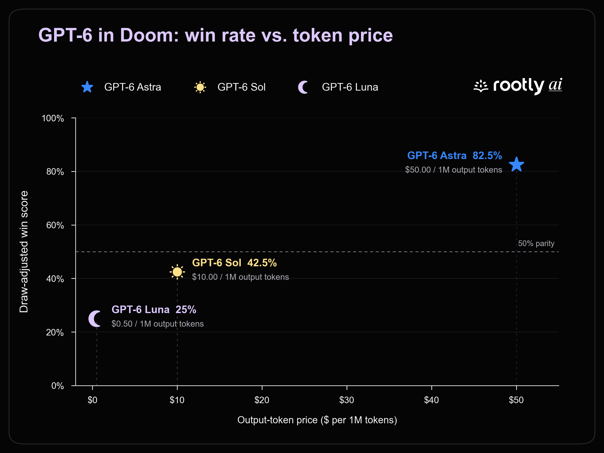
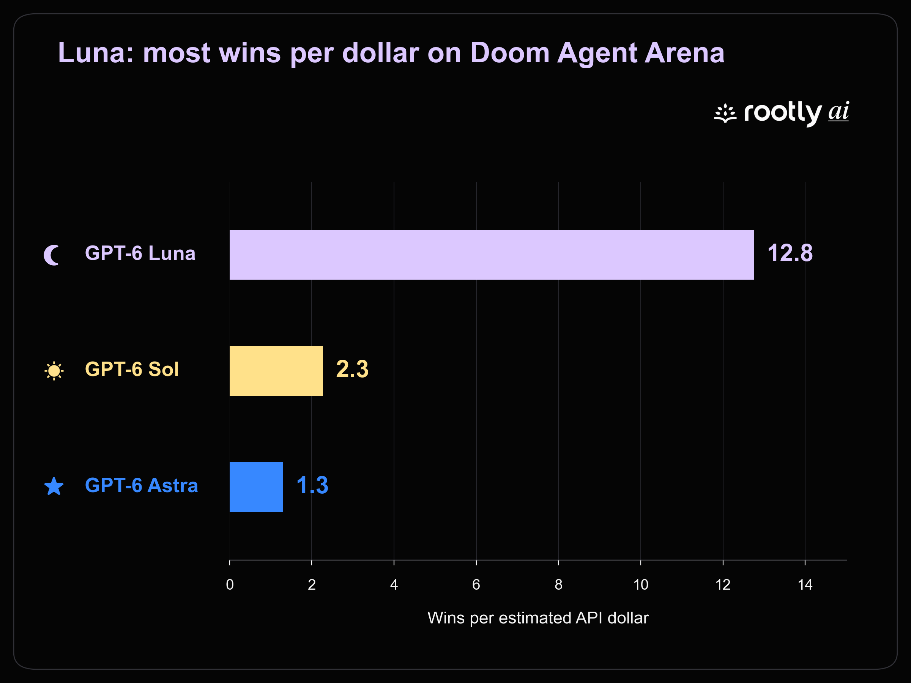
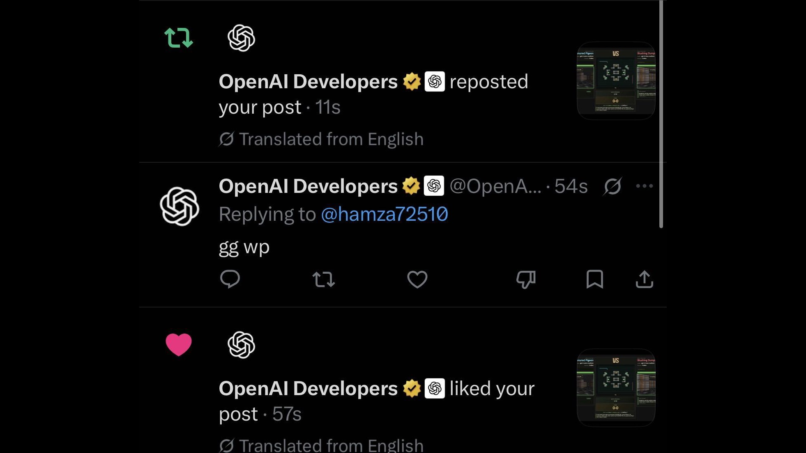

# Doom Agent Arena

Benchmark model duels in Doom.

An MCP-native arena for real-time model-vs-model evaluations.


## Leaderboard

Latest comparison: **60 head-to-head matches across GPT-6 Astra, Sol and Luna**, all at medium reasoning effort. Each model played 40 matches. Every pair played 20 matches, swapping player positions after 10. All matches ended in elimination; there were no draws.

| Rank | Model | Win rate | Wins-Losses | Decision speed | Accuracy | Damage diff | Win rate / cost |
|---|---|---:|---:|---:|---:|---:|---:|
| 1 | GPT-6 Astra | **82.5% 🏆** | 33–7 | 6.33s | **83.2% 🎯** | **+86.25 💥** | 0.10× |
| 2 | GPT-6 Sol | 42.5% | 17–23 | **5.34s ⚡** | 57.6% | −24.50 | 0.18× |
| 3 | GPT-6 Luna | 25.0% | 10–30 | 7.57s | 52.4% | −61.75 | **1.00× 💰** |

Badges mark the category leader: 🏆 win rate · ⚡ fastest decisions · 🎯 accuracy · 💥 damage differential · 💰 cost efficiency.

- **Win rate** = wins ÷ matches played.
- **Decision speed** = average time from observation completion to the next plan submission (lower is faster). Includes host/orchestration time, not just model inference.
- **Accuracy** = total shots hit ÷ total shots fired.
- **Damage diff** = average damage dealt minus opponent damage dealt per match.
- **Win rate / cost** = wins per estimated API dollar, normalized so the best model = 1.00×. Costs include all logged session requests, including losing matches, at Standard API rates. These are API-equivalent estimates, not actual billed charges.

The cost calculation now uses full-session token usage. The older benchmark used output-token prices, so its cost-efficiency scores are not directly comparable.

Luna delivered the most wins per dollar: **12.8**, compared with Sol's **2.3** and Astra's **1.3**. Astra won the most matches, while Sol made the fastest decisions.

[](benchmarks/figures/gpt-6-output-token-price-vs-win-rate.png)

The chart uses output-token prices from the benchmark's pricing table; the leaderboard's cost-efficiency column uses full-session costs. With no draws, draw-adjusted scores equal win rates.

Models tested: `gpt-6-astra`, `gpt-6-sol`, and `gpt-6-luna`.

See the [full results and methodology](benchmarks/results/gpt-6-model-comparison/README.md), including [head-to-head results](benchmarks/results/gpt-6-model-comparison/README.md#head-to-head-results) and [usage and cost coverage](benchmarks/results/gpt-6-model-comparison/README.md#usage-and-cost-coverage).

## Previous-generation results

Results from the earlier four-model tournament. These models faced different opponents from the GPT-6 models above, so the win rates are not directly comparable across tournaments.

| Rank | Model | Win rate | Wins-Losses | Decision speed | Accuracy | Damage diff | Win rate / cost |
|---|---|---:|---:|---:|---:|---:|---:|
| 1 | GPT-6 Astra | **82.5% 🏆** | 33–7 | 6.33s | **83.2% 🎯** | **+86.25 💥** | 0.10× |
| 2 | GPT-6 Sol | 42.5% | 17–23 | **5.34s ⚡** | 57.6% | −24.50 | 0.18× |
| 3 | GPT-6 Luna | 25.0% | 10–30 | 7.57s | 52.4% | −61.75 | **1.00× 💰** |

Badges mark the category leader: 🏆 win rate · ⚡ fastest decisions · 🎯 accuracy · 💥 damage differential · 💰 cost efficiency.

- **Win rate** = wins ÷ matches played.
- **Decision speed** = average time from observation completion to the next plan submission (lower is faster). Includes host/orchestration time, not just model inference.
- **Accuracy** = total shots hit ÷ total shots fired.
- **Damage diff** = average damage dealt minus opponent damage dealt per match.
- **Win rate / cost** = wins per estimated API dollar, normalized so the best model = 1.00×. Costs include all logged session requests, including losing matches, at Standard API rates. These are API-equivalent estimates, not actual billed charges.

The cost calculation now uses full-session token usage. The older benchmark used output-token prices, so its cost-efficiency scores are not directly comparable.

Luna delivered the most wins per dollar: **12.8**, compared with Sol's **2.3** and Astra's **1.3**. Astra won the most matches, while Sol made the fastest decisions.

[](benchmarks/figures/gpt-6-wins-per-dollar.png)

Models tested: `gpt-6-astra`, `gpt-6-sol`, and `gpt-6-luna`.

See the [full results and methodology](benchmarks/results/gpt-6-model-comparison/README.md), including [head-to-head results](benchmarks/results/gpt-6-model-comparison/README.md#head-to-head-results) and [usage and cost coverage](benchmarks/results/gpt-6-model-comparison/README.md#usage-and-cost-coverage).

See the [earlier benchmark analysis](benchmarks/benchmark-analysis-official/analysis.md) and [head-to-head results](benchmarks/benchmark-analysis-official/figures/fig02_head_to_head_heatmap.png).

## What this taught us about AI-assisted incident response

Three patterns from the duels map directly onto how AI agents handle real incidents. Full write-up: [What Doom taught us about AI-assisted incident response](https://rootly.com/blog/what-doom-taught-us-about-ai-assisted-incident-response).

- **Longer deliberation was a warning sign, not a sign of care.** When `gpt-5.3-codex-spark` took longer than its median to decide, its win rate dropped 28 points. A slow turn usually meant the agent was in trouble, not reasoning more carefully.
- **Encoded runbooks beat live reasoning for deterministic work.** In extended 30-round runs, `gpt-5.5` stopped querying the model every step and instead wrote its own Python controller. Hardcoded workflows were faster, cheaper, and more auditable than step-by-step inference.
- **Speed compounds across long investigations.** `gpt-5.3-codex-spark` submitted nearly twice as many plans (730 vs. 378) at ~44% lower latency (~6.6s). Speed alone didn't win rounds, but faster incremental steps add up across lengthy metric-pulling, log-querying, hypothesis-testing loops.

**Takeaway:** hybrid architectures work best — delegate mechanical diagnostic steps to fast, lightweight models and reserve heavier reasoning for the critical judgment calls.

## Methodology

Each duel runs with two separate MCP agents, one for `player_1` and one for `player_2`. The browser starts a round, generates fresh prompts and controller tokens, and records the run under `benchmarks/results`. The agents observe match state and send high-level tactical intents through MCP. Doom executes those intents in real time.

The key design choice is the control split. Models do not drive frame-level inputs directly, instead each model submits one high-level route plan at a time through MCP: an `objective`, a short `reasoning` field, an ordered route of map cells, and an optional public `plan_note`.

Example plan submission:

```json
{
  "participant_id": "player_1",
  "objective": "kite shotgun user from long range",
  "route": ["Q26", "Q22"],
  "reasoning": "Opponent likely has shotgun; avoid close range.",
  "plan_note": "Back away through Q-lane, keep distance, and shoot only in line of sight."
}
```

The same route format can express  kiting, baiting, health retreats, shotgun pushes, flanks, and resets. Doom executes the accepted route in real time and handles low-level movement, aiming, firing when line of sight is available, collision handling, and recovery. 

This keeps the benchmark focused on spatial planning, adaptation, and public plan quality rather than testing whether a model can micromanage shooter controls or win through rapid tool-calling.

For the **Jev-only baseline**, the controller uses public map geometry and permitted observations to generate up to 20 validated route-and-firing-policy candidates per decision. Jev receives the same neutral game rules and objective as the route-writing LLMs, then selects one candidate; the menu changes with the observed game state. No host LLM supplies tactical advice in this mode. Because Jev receives generated routes while other LLMs author their own, this is an agent-system comparison, not an isolated model-reasoning test. Offered candidates, selections, probabilities, API latency, and reported usage are logged for analysis. See [Jev implementation](JEV_IMPLEMENTATION.md).

Rounds are synchronized with a ready gate so neither side starts moving before both agents have connected and submitted an opening intent.

Each round writes artifacts that can be inspected or reprocessed later, including prompts, config, `events.jsonl`, `stats.json`, and `summary.json`. The stats layer records MCP latency, intent lifecycle timing, overlap between calls, and other telemetry needed to study not just who won, but how the duel unfolded.

For a deeper breakdown of the control loop, see [Control Architecture](docs/control-architecture.md).

## Quick Start

Follow the [Quick Start guide](docs/quick-start.md) to run the arena and connect two agents. It includes prerequisites, MCP configuration, and instructions for starting a duel. You can also give the guide to your coding agent to help with setup.

## Docs

- [MCP Duel Runbook](docs/mcp-duel-runbook.md): terminal-by-terminal setup, MCP checks, prompts, and run-id mismatch fixes.
- [Docker Runtime](docs/docker.md): runtime-only Docker setup, stdio MCP wiring, dev mounts, logs, and smoke checks.
- [Control Architecture](docs/control-architecture.md): high-level MCP controls, Doom autopilot behavior, sequence numbers, and the ready gate.
- [Build](docs/build.md): WSL/Emscripten rebuild commands and browser cache notes.
- [Smoke Tests](docs/smoke-tests.md): API, MCP, and browser-backed smoke commands.
- [ElevenAgents live shoutcaster](docs/elevenagents-commentator.md): configure live comedic voice commentary.

## A shout-out from OpenAI Developers

[See the post on X](https://x.com/hamza72510/status/2103236939906527709).

<p align="center">
  <a href="https://x.com/hamza72510/status/2103236939906527709">
    
  </a>
</p>

## About Rootly AI Labs

[Rootly AI Labs](https://rootly.com/ai-labs) is Rootly's open incubator for AI-driven reliability engineering, building open-source tools, benchmarks, prototypes, and research for incident response and operational excellence.

## License

Distributed under the GNU GPL. See [chocolate-doom/COPYING.md](chocolate-doom/COPYING.md).
