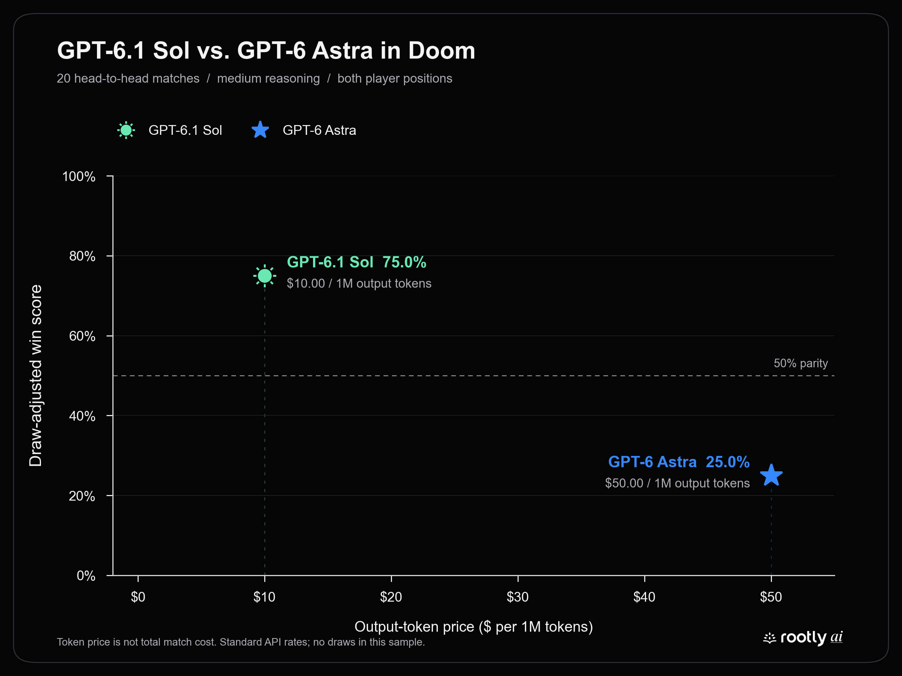

# GPT-6.1 Sol vs GPT-6 Astra in Doom

**GPT-6.1 Sol won 15–5 (75%)** across 20 direct matches against GPT-6 Astra. Both models used medium reasoning and played ten matches from each player position.

This figure uses **only their direct matchup**, not their results against Sol or Luna. Its x-axis shows Standard output-token price, not total match cost. No draws occurred.

## Results

| Metric | GPT-6.1 Sol | GPT-6 Astra |
|---|---:|---:|
| Wins–losses | **15–5** | 5–15 |
| Win rate | **75%** | 25% |
| Estimated full-session cost | $1.6854 | $14.9184 |
| Estimated plan-request cost | $1.0125 | $9.2733 |
| Mean observation-to-plan time | 6.70 s | 6.92 s |
| Median observation-to-plan time | 5.98 s | 6.09 s |
| Estimated cost per match | $0.084 | $0.746 |
| Shot accuracy (hits/shots) | 83.3% (85/102) | 81.4% (70/86) |
| Damage differential per match | +39.25 | -39.25 |

## Main findings

- **The win advantage held in both orientations:** 6.1 Sol won 8–2 as Player 1 and 7–3 as Player 2.
- **Lower estimated total usage cost:** $1.69 for 6.1 Sol versus $14.92 for Astra—8.85× less expensive under the Standard-rate estimate.
- **Route validity and winning are different:** 6.1 Sol won more despite a higher route-rejection rate in this head-to-head subset. Do not substitute the expanded leaderboard’s pooled error rates here.

## Route errors, separated from operational failures

| Category | GPT-6.1 Sol | GPT-6 Astra |
|---|---:|---:|
| Diagonal segment | 23 | 14 |
| Blocked cell/crossing | 3 | 2 |
| Too many waypoints | 0 | 0 |
| Invalid stationary route | 0 | 0 |
| Post-finish submission (excluded) | 8 | 10 |
| Controller/run mismatch (excluded) | 0 | 0 |
| **Invalid / validated routes** | **26/104 (25.0%)** | **16/106 (15.1%)** |

Route rejection counts the first four categories divided by accepted plus invalid route submissions. Retries are separate attempts. Post-finish and controller/run errors are excluded from numerator and denominator.

## The two series

| Player 1 | Player 2 | P1–P2 | Archive |
|---|---|---:|---|
| GPT-6.1 Sol | GPT-6 Astra | 8–2 | [Series 7](7_gpt-6.1-sol_vs_gpt-6-astra/) |
| GPT-6 Astra | GPT-6.1 Sol | 3–7 | [Series 8](8_gpt-6-astra_vs_gpt-6.1-sol/) |

## Measurement notes

- Twenty unique matches recorded September 29, 2026; all ended in elimination. The original artifacts remain unchanged.
- Model identities and medium reasoning come from verified Codex rollout turn contexts. Incorrect Astra readiness labels are corrected in the archive notes.
- Costs are **API-equivalent estimates, not invoices or Codex subscription charges**. They include all requests in the four dedicated participant rollouts. Plan-request cost is a narrower subset. Service tier was not recorded; Standard rates are assumed.
- Per-million token rates (input / cached / cache-write / output): 6.1 Sol $2 / $0.10 / $2.50 / $10; Astra $10 / $1 / $12.50 / $50. See [6.1 Sol pricing](https://developers.openai.com/api/docs/models/gpt-6.1-sol) and [Astra pricing](https://developers.openai.com/api/docs/models/gpt-6-astra); pricing basis is the same as the [combined report](README.md).
- Decision times pool 112 recorded observation-to-plan intervals for 6.1 Sol and 115 for Astra, including rejected attempts and orchestration. They are not pure model inference or time to an accepted plan.
- The continuing-session design allows prior-round context. These are not 20 fully independent trials, and the scores alone do not establish adaptation, baiting, or a general model advantage.

## Files and reproduction

- [PNG figure](../../figures/astra-vs-sol61-token-price-vs-win-rate.png) · [SVG figure](../../figures/astra-vs-sol61-token-price-vs-win-rate.svg)
- [Head-to-head metrics](astra-vs-sol61.json) · [Full 120-match report](README.md)
- Run `python benchmarks/results/gpt-6-model-comparison/analyze_astra_vs_sol61.py`.
- Run `python benchmarks/figures/generate_gpt61_token_price_chart.py --astra-vs-sol`.
