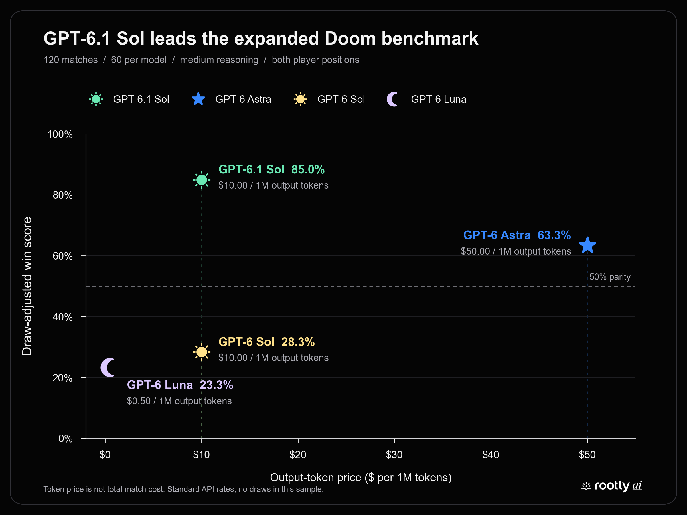

# GPT-6.1 Sol in Doom: 51 wins in 60 matches

GPT-6.1 Sol won **51–9 (85%)** against GPT-6 Astra, Sol, and Luna: 20 matches per opponent, with player positions swapped after each ten-match series. The full four-model archive now contains **120 unique completed matches**, with **60 appearances per model**.

The figure uses all 120 matches, not the earlier three-model percentages. Its x-axis is Standard output-token price, **not total match cost**. All matches have a winner, so draw-adjusted score equals win rate.

## Most interesting results

- **6.1 Sol won every matchup:** 15–5 against Astra, 20–0 against Sol, and 16–4 against Luna. It won all six ten-match series, including both player orientations.
- **The clearest upgrade is against the older Sol:** 20 wins from 20 head-to-head rounds. Both have a $10/M output-token price; 6.1 has a lower cached-input rate ($0.10/M versus $0.20/M).
- **Strong results at modest estimated usage cost:** 6.1 Sol cost **$5.69 total**, **$0.095 per match**, or **$0.112 per win**. These include logged observation, polling, setup, and retry requests—not only plan-generating requests.
- **The advantage persisted on both sides:** 27/30 wins as Player 1 (90%) and 24/30 as Player 2 (80%). It was not confined to one spawn orientation.
- **Winning did not mean flawless route generation:** 6.1 Sol had 112/421 invalid route submissions (26.6%), versus 81/327 for Astra (24.8%). Post-finish and controller/run errors are excluded from both numerator and denominator; retries remain included. See the full error breakdown below.
- **Astra still had the higher shot hit rate:** 82.7% versus 77.2% for 6.1 Sol, yet 6.1 won more matches. Shot accuracy alone does not explain victory.
- **Luna remains the cheapest:** approximately $1.20 across its 60 appearances, but won 14/60. Its estimated wins per dollar remain higher than 6.1 Sol’s; the strongest win rate and the cheapest wins are different objectives.

These are descriptive results from this benchmark, not proof of general model superiority or a causal explanation of strategy.

## GPT-6.1 Sol head-to-head

| Opponent | 6.1 as P1 | 6.1 as P2 | Combined 6.1 wins–losses | Win rate |
|---|---:|---:|---:|---:|
| GPT-6 Astra | 8–2 | 7–3 | **15–5** | 75% |
| GPT-6 Sol | 10–0 | 10–0 | **20–0** | 100% |
| GPT-6 Luna | 9–1 | 7–3 | **16–4** | 80% |

## Expanded leaderboard

| Model | Wins–losses | Win rate | Mean decision time | Shot accuracy | Damage differential / match | Estimated full-session cost |
|---|---:|---:|---:|---:|---:|---:|
| GPT-6.1 Sol | 51–9 | 85.0% | 5.66 s | 77.2% | +65.58 | $5.69 |
| GPT-6 Astra | 38–22 | 63.3% | 6.53 s | 82.7% | +44.42 | $40.30 |
| GPT-6 Sol | 17–43 | 28.3% | 5.91 s | 49.8% | -50.75 | $10.83 |
| GPT-6 Luna | 14–46 | 23.3% | 8.03 s | 47.8% | -59.25 | $1.20 |

Decision time is the pooled interval from observation completion to a plan submission, including orchestration and rejected attempts. It is **not model-server inference time**, and retry intervals may share an observation. Counts: 443 for 6.1 Sol, 351 Astra, 299 Sol, and 315 Luna. 6.1 Sol’s median is 5.31 s. Accuracy is pooled hits/shots, not an average of round percentages.

## Route validation and operational errors

**Route rejection rate = invalid route submissions / (accepted + invalid route submissions).** Count each attempted call, including retries. Operational failures did not reach route validation and are excluded from this rate. Unknown error messages cause the analysis to fail for manual review rather than being silently assigned to a category.

| Error type | Meaning | Route-generation error? |
|---|---|---|
| Diagonal segment | Consecutive waypoints change both row and column | Yes |
| Blocked cell/crossing | Route enters or crosses a wall | Yes |
| Too many waypoints | Route exceeds the eight-waypoint limit | Yes |
| Invalid stationary route | No movement without the required hold objective/policy | Yes |
| Post-finish submission | Plan arrives after the match finishes | No |
| Controller-token/run mismatch | Client and controller refer to different rounds | No |

| Model | Diagonal | Blocked | Too many waypoints | Stationary | Invalid / validated | Route rejection rate |
|---|---:|---:|---:|---:|---:|---:|
| GPT-6.1 Sol | 105 | 5 | 0 | 2 | 112/421 | 26.6% |
| GPT-6 Astra | 77 | 4 | 0 | 0 | 81/327 | 24.8% |
| GPT-6 Sol | 18 | 4 | 0 | 0 | 22/282 | 7.8% |
| GPT-6 Luna | 22 | 16 | 1 | 0 | 39/302 | 12.9% |

| Model | Post-finish | Run mismatch | All plan calls | Combined errors / all calls (not route rejection) |
|---|---:|---:|---:|---:|
| GPT-6.1 Sol | 28 | 0 | 449 | 140/449 (31.2%) |
| GPT-6 Astra | 27 | 2 | 356 | 110/356 (30.9%) |
| GPT-6 Sol | 23 | 0 | 305 | 45/305 (14.8%) |
| GPT-6 Luna | 27 | 0 | 329 | 66/329 (20.1%) |

### Why this differs from the earlier Jev comparison

The earlier [Jev–Astra report](../jev_astra/analysis.md) counted 27 explicit invalid routes out of 235 submissions (11.5%). The previously highlighted 31.2%/30.9% here combined invalid routes with operational failures; those are not equivalent metrics. The combined figures remain above for auditing, not as route-generation scores.

| Cohort | Model | Invalid / validated | Route rejection rate |
|---|---|---:|---:|
| Original GPT-6 series 1–6 | GPT-6 Astra | 65/221 | 29.4% |
| Original GPT-6 series 1–6 | GPT-6 Sol | 21/203 | 10.3% |
| Original GPT-6 series 1–6 | GPT-6 Luna | 11/184 | 6.0% |
| 6.1 extension series 7–12 | GPT-6.1 Sol | 112/421 | 26.6% |
| 6.1 extension series 7–12 | GPT-6 Astra | 16/106 | 15.1% |
| 6.1 extension series 7–12 | GPT-6 Sol | 1/79 | 1.3% |
| 6.1 extension series 7–12 | GPT-6 Luna | 28/118 | 23.7% |

Astra’s 6.1-extension rate is closer to the earlier Jev result; its original GPT-6 series raise the pooled rate. Different opponents, dates, trajectories, and continuing-session history mean this is not evidence of a model regression. Jev also receives generated, validated routes, so its route-error rate is not a like-for-like route-construction comparison.

**Correction scope:** only error categorization and its denominator changed. Match outcomes, token costs, shot accuracy, damage, existing observation-to-submission timings, and the win-rate/token-price figure are unchanged. The timing metric is not time to a valid plan.

## Cost and token accounting

Costs are **Standard API-equivalent estimates, not actual invoices or Codex subscription charges**. Pricing source: [official GPT-6.1 Sol model documentation](https://developers.openai.com/api/docs/models/gpt-6.1-sol), checked September 29, 2026; [official API pricing](https://developers.openai.com/api/docs/pricing) for the original models.

| 6.1 Sol usage across six sessions | Amount |
|---|---:|
| Full-session estimated cost | $5.690672 |
| Plan-producing requests only | $2.356392 |
| Other session requests | $3.334281 |
| Total input tokens | 37,965,681 |
| Cached input (included above) | 37,347,584 |
| Uncached input | 618,097 |
| Cache-write tokens | 0 |
| Output tokens | 71,972 |
| Reasoning output (included above) | 4,791 |
| Model requests | 664 |
| Plan-producing model requests | 269 |

6.1 rates per million: **$2 uncached input, $0.10 cached input, $2.50 cache writes, $10 output**. Cached input is 98.37% of input usage. Reasoning is already included in output, not charged twice. The script deduplicates by response ID and reconciles each supplemental rollout to its final cumulative token count. No included request exceeds 272K input tokens. Service tier was not recorded, so Fast/regional surcharges are not assumed.

Formula: `(uncached input × input rate + cached input × cache rate + cache writes × write rate + output × output rate) / 1,000,000`.

Astra’s estimated full-session cost across its 60 matches was $40.30 versus $5.69 for 6.1 Sol (7.08×). Across just their 20 head-to-head matches, Astra cost $14.92 versus $1.69 for 6.1 Sol (8.85×). These compare logged usage under Standard rates, not billed charges.

| Series | 6.1 Sol estimated cost |
|---|---:|
| GPT-6.1 Sol vs GPT-6 Astra | $1.0809 |
| GPT-6 Astra vs GPT-6.1 Sol | $0.6045 |
| GPT-6.1 Sol vs GPT-6 Sol | $1.3432 |
| GPT-6 Sol vs GPT-6.1 Sol | $0.6078 |
| GPT-6.1 Sol vs GPT-6 Luna | $0.9149 |
| GPT-6 Luna vs GPT-6.1 Sol | $1.1394 |

Full-session costs include all recorded requests in the dedicated participant rollouts. Plan-request costs count a request once if it emits any plan submission, including retries/batched tools. This differs from arena plan-call and decision-interval counts.

## Completed series

| # | Archive | Player 1 | Player 2 | P1–P2 |
|---|---|---|---|---:|
| 1 | [1_astra_sol](1_astra_sol/) | GPT-6 Astra | GPT-6 Sol | 9–1 |
| 2 | [2_sol_astra](2_sol_astra/) | GPT-6 Sol | GPT-6 Astra | 1–9 |
| 3 | [3_astra_luna](3_astra_luna/) | GPT-6 Astra | GPT-6 Luna | 10–0 |
| 4 | [4_luna_astra](4_luna_astra/) | GPT-6 Luna | GPT-6 Astra | 5–5 |
| 5 | [5_sol_luna](5_sol_luna/) | GPT-6 Sol | GPT-6 Luna | 9–1 |
| 6 | [6_luna_sol](6_luna_sol/) | GPT-6 Luna | GPT-6 Sol | 4–6 |
| 7 | [7_gpt-6.1-sol_vs_gpt-6-astra](7_gpt-6.1-sol_vs_gpt-6-astra/) | GPT-6.1 Sol | GPT-6 Astra | 8–2 |
| 8 | [8_gpt-6-astra_vs_gpt-6.1-sol](8_gpt-6-astra_vs_gpt-6.1-sol/) | GPT-6 Astra | GPT-6.1 Sol | 3–7 |
| 9 | [9_gpt-6.1-sol_vs_gpt-6-sol](9_gpt-6.1-sol_vs_gpt-6-sol/) | GPT-6.1 Sol | GPT-6 Sol | 10–0 |
| 10 | [10_gpt-6-sol_vs_gpt-6.1-sol](10_gpt-6-sol_vs_gpt-6.1-sol/) | GPT-6 Sol | GPT-6.1 Sol | 0–10 |
| 11 | [11_gpt-6.1-sol_vs_gpt-6-luna](11_gpt-6.1-sol_vs_gpt-6-luna/) | GPT-6.1 Sol | GPT-6 Luna | 9–1 |
| 12 | [12_gpt-6-luna_vs_gpt-6.1-sol](12_gpt-6-luna_vs_gpt-6.1-sol/) | GPT-6 Luna | GPT-6.1 Sol | 3–7 |

The final series is `session_f2da9a461021`: Clipboard Cowboy (GPT-6 Luna) vs Panic Ravioli (GPT-6.1 Sol), 3–7. Both identities and medium reasoning were verified from actual Codex turn contexts. It was moved into folder 12; all ten summary hashes were preserved. Earlier partial/restarted sessions, including `session_727df085b217`, are excluded. Archived copies of series 10 and 11 must not be counted again from their original directories.

## Methodology and limitations

- Six model pairs, two orientations per pair, ten matches per orientation. Each model faces every other model 20 times, with 30 appearances per player side.
- All 120 run IDs are unique; each included series contains rounds 1–10. There are 119 eliminations and one health-at-timeout result (series 11, round 1, won by 6.1 Sol). No draws.
- Original GPT-6 matchups were recorded September 22; the 6.1 extension was recorded September 29. This is a combined historical leaderboard, **not a simultaneously rerun, fully frozen-version experiment**. Prompt/controller/UI changes and session continuity may confound cross-date comparisons.
- Within-series prior-round context can affect play. Ten rounds in a continuing session should not be treated as ten fully independent trials; no significance claim is made.
- Model labels in several readiness records were wrong. Series 7/8 Astra and series 11 Luna use verified rollout identities documented in their archive notes; raw match artifacts were not rewritten.
- This compares complete agent systems, including the route controller, tool overhead, retries, and allowed history. No strategic explanation such as baiting or adaptation is inferred from the score alone.

## Reproduce and inspect

- Run `python benchmarks/results/gpt-6-model-comparison/analyze_expanded.py` with the indexed local Codex rollouts available.
- Run `python benchmarks/figures/generate_gpt61_token_price_chart.py` to regenerate the PNG and SVG.
- [Expanded metrics and cost/session manifest](expanded_analysis.json)
- [Original cost audit](cost_analysis.json) and [previous report preserved before this update](README-pre-6.1-update.md)
- [Full-resolution PNG](../../figures/gpt-6.1-output-token-price-vs-win-rate.png) · [SVG](../../figures/gpt-6.1-output-token-price-vs-win-rate.svg)
